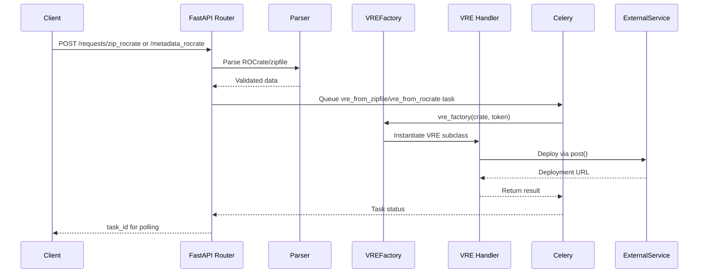

# Dispatcher Project Architecture

## Overview

Dispatcher is a FastAPI-based REST API that manages Virtual Research Environment (VRE) deployments. It authenticates users via EGI Checkin, accepts ROCrate or zip file inputs, and orchestrates workflow deployment to various VRE platforms (Galaxy, Binder, Jupyter, OSCAR, Sciencemesh, Scipion).

## Architecture Flow

## Key Components

### Routers (`app/routers/`)
- [`requests.py`](app/routers/requests.py): Main endpoints for submitting requests (zip_rocrate, metadata_rocrate, status)
- [`auth.py`](app/routers/auth.py): Authentication-related endpoints
- [`anonymous_requests.py`](app/routers/anonymous_requests.py): Unauthenticated endpoints
- [`utils/__init__.py`](app/routers/utils/__init__.py): Shared utilities (parse_zipfile, parse_rocrate, oauth2_scheme)

### Domain Layer (`app/domain/`)
- [`rocrate/`](app/domain/rocrate/): ROCrate parsing and validation logic

### VRE Handlers (`app/vres/`)
Base class and concrete implementations:
- [`base_vre.py`](app/vres/base_vre.py): Abstract `VRE` base class with `VREFactory` singleton
- [`galaxy.py`](app/vres/galaxy.py): Galaxy VRE handler
- [`binder.py`](app/vres/binder.py): Binder VRE handler
- [`jupyter.py`](app/vres/jupyter.py): Jupyter VRE handler
- [`oscar.py`](app/vres/oscar.py): OSCAR VRE handler
- [`sciencemesh.py`](app/vres/sciencemesh.py): Sciencemesh VRE handler
- [`scipion.py`](app/vres/scipion.py): Scipion VRE handler

### Celery Tasks (`app/celery/`)
- [`tasks.py`](app/celery/tasks.py): Background jobs (`vre_from_zipfile`, `vre_from_rocrate`)
- [`worker.py`](app/celery/worker.py): Celery worker configuration

### Services (`app/services/`)
- [`im.py`](app/services/im.py): Infrastructure Manager client

### Core Files
- [`main.py`](app/main.py): FastAPI app initialization, middleware, OAuth2 setup
- [`config.py`](app/config.py): Application settings
- [`constants.py`](app/constants.py): VRE-specific defaults (service URLs, programming language identifiers)
- [`exceptions.py`](app/exceptions.py): Domain-specific exceptions (VREError, GalaxyAPIError, etc.)

## Data Flow

1. **Input**: Client submits ROCrate JSON or zip file containing `ro-crate-metadata.json`
2. **Validation**: [`parse_rocrate()`](app/routers/utils/vre.py:11) or [`parse_zipfile()`](app/routers/utils/vre.py:61) validates:
   - `mainEntity` exists and is an object
   - `programmingLanguage` object with `identifier` present
3. **Factory Pattern**: [`VREFactory.__call__()`](app/vres/base_vre.py:110) selects VRE handler based on `programmingLanguage.identifier`
4. **Async Processing**: Celery tasks handle deployment to avoid blocking
5. **Polling**: Clients poll `/requests/{task_id}` for status

## Programming Language Identifiers (Constants)

| VRE | Identifier | Default Service |
|-----|------------|-----------------|
| Galaxy | `https://galaxyproject.org/` | `https://usegalaxy.eu/` |
| Binder | `https://jupyter.org/binder/` | `https://mybinder.org` |
| ScienceMesh | `https://qa.cernbox.cern.ch` | `https://qa.cernbox.cern.ch` |
| Scipion | `http://scipion.i2pc.es/` | `https://scipion.i2pc.es/` |
| OSCAR | `https://oscar.grycap.net/` | `https://oscar.vre.eosc-data-commons.eu` |
| Jupyter | `https://jupyter.org` | `https://notebooks-dev.egi.zcu.cz` |

