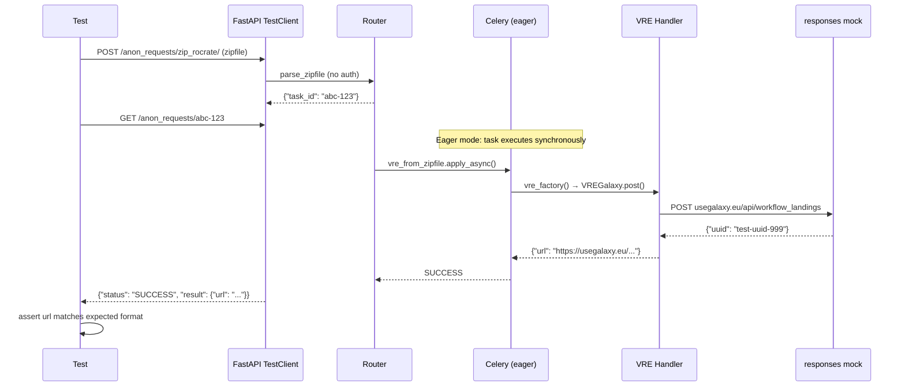

# Integration / E2E Testing Strategy for Dispatcher

## 1. Test Pyramid Positioning

```
         ┌─────────┐
         │  E2E    │  Live VRE staging (manual/scheduled, 1-2 handlers)
         │ (layer3)│
        ┌┴─────────┴┐
        │Integration│  FastAPI TestClient + real Celery + fake VREs (CI, all handlers)
        │ (layer2)  │
       ┌┴───────────┴┐
       │    Unit      │  Already exists (mock everything)
       │   (layer1)   │
       └─────────────┘
```

- **Unit tests**: Already comprehensive. Continue as-is.
- **Integration tests**: **Primary new addition.** Spin up the FastAPI app with `TestClient`, run Celery in eager/sync mode (or against a test Redis), and intercept outbound HTTP with `responses` or `pytest-httpx`.
- **E2E tests**: Optional, manual or scheduled cron, only for VREs with staging instances.

---

## 2. Authentication Strategy for Tests

### Problem
The dispatcher uses real OIDC via EGI Checkin (`fastapi-oauth2` middleware). Tests cannot perform a real browser-based OAuth2 flow.

### Proposed Solution: Three-tier approach

#### Tier A — Anonymous Endpoints (zero auth overhead)
The existing [`/anon_requests/`](app/routers/anonymous_requests.py) endpoints require **no token**. These are the ideal entry point for integration tests. They already pass an empty string `""` as the token to Celery tasks.

**Use for**: 80% of integration tests. All VRE handlers that don't require a real user token at the external service.

**Limitation**: Handlers like Jupyter (`_get_userinfo`), OSCAR (Bearer auth to external service), and IM (`_build_auth_config` with access token) will fail with empty tokens. These need Tier B.

#### Tier B — FastAPI Dependency Override (fake but valid-looking token)
FastAPI's `app.dependency_overrides` allows replacing `oauth2_scheme` with a test fixture that returns a synthetic token string.

```python
# In test conftest
from app.routers.utils import oauth2_scheme

def fake_token():
    return "test-integration-token-12345"

app.dependency_overrides[oauth2_scheme] = fake_token
```

**Use for**: Handlers that need a non-empty bearer token (Jupyter, OSCAR, IM). The token won't be valid at the real service — the outbound HTTP is intercepted anyway.

#### Tier C — Real OIDC Token (E2E only)
For true end-to-end tests against staging VRE services, a real EGI Checkin token must be obtained, e.g., via a client credentials grant or a pre-provisioned long-lived token stored in CI secrets.

**Use for**: Scheduled E2E runs against staging Galaxy / ScienceMesh.

---

## 3. VRE-side Verification Strategy

### Core Principle: Contract Verification, Not Side-Effect Verification

For all VRE handlers except possibly Scipion, we **cannot reliably verify** that a VRE was actually created in the external system without running against that system. Instead, we verify that:

1. The correct HTTP request was composed (URL, method, headers, body)
2. The response was parsed correctly
3. The returned URL is well-formed
4. The Celery task lifecycle is correct

### VRE-by-VRE Verification Table

| VRE | Integration Test Verifies | E2E (if staging available) |
|-----|--------------------------|---------------------------|
| **Scipion** | Returns `svc_url` directly | N/A (trivial) |
| **Galaxy** | POST to `{svc}/api/workflow_landings` with correct request_state payload; parses `uuid` from response; builds correct landing URL | GET landing URL from staging Galaxy; confirm 200 |
| **Binder** | Creates git repo on disk; returns BinderHub URL with correct `git/` prefix | N/A (BinderHub build takes minutes) |
| **ScienceMesh** | POST to `{svc}/ocm/shares` with correct OCM payload; returns JSON | POST to staging ScienceMesh; verify share created |
| **OSCAR** | POST to `{svc}/system/services` with FDL; POST job invocations; returns service URL | N/A (requires real OSCAR cluster) |
| **Jupyter** | GET userinfo; POST server start; POST token creation; polls userinfo; PUT notebook; returns user URL | N/A (requires real JupyterHub + user account) |
| **VIP** | POST to `{svc}/rest/executions` with correct pipeline payload; returns home URL | N/A |
| **IM/TOSCA** | IMClient receives correct TOSCA template; `run_service` lifecycle (create → wait → outputs) | N/A (provisions real VMs) |

---

## 4. Architecture: Integration Test Infrastructure

### Docker Compose for Integration Tests

Create a `test/e2e/docker-compose.test.yml`:

```yaml
services:
  redis:
    image: redis:7-alpine
    ports:
      - "6379:6379"

  web:
    build:
      context: ../..
      dockerfile: Dockerfile
    command: uvicorn app.main:app --host 0.0.0.0 --port 8000
    ports:
      - "8000:8000"
    environment:
      - CELERY_BROKER_URL=redis://redis:6379/0
      - CELERY_RESULT_BACKEND=redis://redis:6379/0
      - DISPATCHER_TEST_MODE=true
    depends_on:
      - redis

  worker:
    build:
      context: ../..
      dockerfile: Dockerfile
    command: celery -A app.celery.worker.celery worker --loglevel=info
    environment:
      - CELERY_BROKER_URL=redis://redis:6379/0
      - CELERY_RESULT_BACKEND=redis://redis:6379/0
    depends_on:
      - redis
      - web
```

### Test Dependencies to Add

```
# In requirements.txt or test extra:
pytest-httpx>=0.30.0    # Intercept HTTPX calls (for async handlers if needed)
responses>=0.25.0       # Intercept requests library calls (VRE handlers use `requests`)
pytest-docker>=3.0.0    # Orchestrate docker-compose for integration tests
```

### Fixture Architecture

```
test/
├── conftest.py                          # Existing unit test fixtures
├── e2e/
│   ├── conftest.py                      # Integration test fixtures
│   │   ├── fastapi_test_client          # TestClient(app) with deps overridden
│   │   ├── celery_eager_mode            # CELERY_TASK_ALWAYS_EAGER = True
│   │   ├── redis_session                # Real Redis (optional, for non-eager)
│   │   ├── mock_vre_service             # responses.RequestsMock for VRE endpoints
│   │   └── test_config                  # Override settings for test
│   ├── test_zip_endpoint.py             # POST /anon_requests/zip_rocrate/
│   ├── test_metadata_endpoint.py        # POST /anon_requests/metadata_rocrate/
│   ├── test_task_polling.py             # GET /anon_requests/{task_id}
│   ├── test_galaxy_integration.py       # Galaxy contract tests
│   ├── test_binder_integration.py       # Binder contract tests
│   ├── test_sciencemesh_integration.py  # ScienceMesh contract tests
│   ├── test_oscar_integration.py        # OSCAR contract tests
│   ├── test_jupyter_integration.py      # Jupyter contract tests
│   ├── test_vip_integration.py          # VIP contract tests
│   ├── test_scipion_integration.py      # Scipion (trivial)
│   └── test_auth_endpoints.py           # Auth bypass behavior
└── fixtures/
    └── rocrate_samples/                 # Real ROCrate JSON fixtures for each VRE
        ├── galaxy/
        │   └── ro-crate-metadata.json
        ├── binder/
        │   ├── ro-crate-metadata.json
        │   └── input.txt
        ├── oscar/
        │   └── ro-crate-metadata.json
        ├── sciencemesh/
        │   └── ro-crate-metadata.json
        ├── jupyter/
        │   └── ro-crate-metadata.json
        ├── vip/
        │   └── ro-crate-metadata.json
        └── scipion/
            └── ro-crate-metadata.json
```

---

## 5. Key Design Decisions

### Celery: Eager vs Real Worker

| Mode | Pros | Cons |
|------|------|------|
| **Eager** (`task_always_eager=True`) | No Redis dependency; synchronous; deterministic | Doesn't test async behavior; no polling; no retry logic |
| **Real Redis + Worker** | Tests real async flow; polling works; retries work | Requires Redis container; slower; non-deterministic timing |

**Recommendation**: Use **Eager mode for CI** (fast, deterministic) and **real worker for a nightly/optional suite** (catches async bugs).

Implement via a fixture that sets `CELERY_TASK_ALWAYS_EAGER` and also provides the real-Redis alternative:

```python
@pytest.fixture(params=["eager", "redis"])
def celery_mode(request):
    if request.param == "eager":
        celery.conf.task_always_eager = True
    else:
        celery.conf.task_always_eager = False
    yield request.param
```

### HTTP Interception

All VRE handlers use the `requests` library (synchronous), with one exception — the Starlette `TestClient` internally may use `httpx`. Two interception libraries:

- **`responses`**: Mocks `requests` at the adapter level. Works perfectly for `requests.post`, `requests.get` used by VRE handlers.
- **`pytest-httpx`**: Mocks `httpx` at the transport level. Needed only if async HTTP is used anywhere (currently it's not, but future-proofing).

**Recommendation**: Use `responses` for all VRE handler HTTP interception. It's simpler and all handlers use `requests`.

Example fixture pattern:

```python
@pytest.fixture
def mock_galaxy_success(responses):
    """Mock Galaxy API to return a successful workflow landing."""
    def callback(request):
        # Verify the request body
        body = json.loads(request.body)
        assert body["workflow_target_type"] == "trs_url"
        assert "request_state" in body
        return (201, {}, json.dumps({"uuid": "test-uuid-999"}))

    responses.add_callback(
        responses.POST,
        "https://usegalaxy.eu/api/workflow_landings",
        callback=callback,
        content_type="application/json",
    )
    return responses
```

---

## 6. Implementation Plan (Todo List)

1. **Create `test/e2e/conftest.py`**: FastAPI `TestClient` fixture with dependency overrides for `oauth2_scheme`, Celery eager config, test settings override, and `responses` mock as a fixture.

2. **Collect ROCrate fixtures per VRE type**: Extract/generate real `ro-crate-metadata.json` files for each VRE handler, placed under `test/fixtures/rocrate_samples/{vre_type}/`.

3. **Implement integration test for `POST /anon_requests/zip_rocrate/`**: Submit a zip file with ROCrate metadata + files, verify task_id is returned, poll for completion, verify result URL.

4. **Implement integration test for `POST /anon_requests/metadata_rocrate/`**: Submit raw JSON ROCrate, verify task_id + polling + result.

5. **Implement per-VRE contract tests**: For each VRE handler (Galaxy, Binder, ScienceMesh, OSCAR, Jupyter, VIP, Scipion), verify the outbound HTTP request shape and result parsing using `responses` interception.

6. **Implement `test_task_polling.py`**: Verify that polling a task_id returns PENDING → SUCCESS with correct result, and non-existent task_id returns appropriate status.

7. **Implement `test_auth_endpoints.py`**: Verify behavior of `/oauth2/login` redirect, `/oauth2/token`, and that authenticated endpoints reject requests without valid tokens.

8. **Add `docker-compose.test.yml`**: For the optional real-worker test suite.

9. **Update `requirements.txt`**: Add `responses` and `pytest-docker` test dependencies.

10. **Update `pytest.ini` or `pyproject.toml`**: Add markers for `integration` and `e2e`, configure test paths.

---

## 7. Configuration Changes Needed

### Test Mode Setting

Add to [`app/config.py`](app/config.py):

```python
class Settings(BaseSettings):
    # ... existing fields ...
    test_mode: bool = False  # When True, OAuth2 can be bypassed in tests
```

### Anonymous Endpoint Enhancements

The current [`/anon_requests/`](app/routers/anonymous_requests.py) already passes `""` as the token. This is sufficient for integration tests since outbound HTTP is intercepted. No changes needed.

### Optional: Test Auth Bypass Router

If Tier B dependency override is insufficient (e.g., you want to test via docker-compose without code changes), add a test-only route that generates a fake token:

```python
# Only loaded when test_mode = True
if settings.test_mode:
    @router.get("/test/token")
    def test_token():
        return {"token": "test-integration-token-12345"}
```

---

## 8. Flow Diagram: Integration Test Lifecycle



---

## 9. Risk Assessment

| Risk | Mitigation |
|------|-----------|
| VRE handlers modify their HTTP contract | Contract tests catch this immediately (they fail if request shape changes) |
| Eager Celery hides async timing bugs | Separate real-worker suite for scheduled runs |
| ROCrate fixtures become stale | These come from `vre-rocrate` library — reference its fixtures rather than copying |
| Redis dependency for real-worker tests | Use `pytest-docker` to auto-start Redis container; fallback to skip marker if Docker unavailable |
| Staging VRE services flaky for E2E | Mark E2E tests with `@pytest.mark.e2e` and never run in CI; manual/scheduled only |
